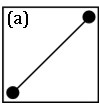
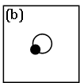

#Bipartite Graphs

#### Questions to think about:
  * How would we represent a graph as a data structure?
  * What are some uses of bipartite graphs?

#### Basic Information:
**What is a graph?**
> A graph is a collection of nodes and edges that show the relationship between
> objects in a given set.  Each node is labeled to show which object it represents,
> and each edge connects (a)two nodes to each other or (b)one node to itself.
>    

**What makes a graph 'bipartite'?**

#### Exercises:

  1. Use the given ordered pairs to connect the graph:

	

  2. Is the above graph bipartite?
  3. Looking at the set of ordered pairs you have been given, is this a directed or undirected graph?

-------------------------------------------
#### Exercise Answers: 

  1. 
  2. No, d connects to both b and g, which means we cannot split the nodes into two groups where no nodes of the same group share an edge.  Similarly, a and b are connected and a is connected to e and f as well.
  3. We cannot fully tell unless it is stated, but this appears to be an undirected graph because a directed graph would need both (a, b) and (b, a) in order to connect a and b fully.
