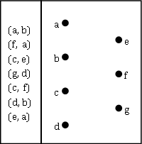
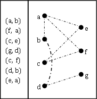

#Bipartite Graphs

#### Questions to think about:

  * What is a graph?
  * What makes a graph 'bipartite'?
  * How would we represent a graph as a data structure?
  * What are some uses of bipartite graphs?

#### Readings:
  * [Graphs](http://en.wikipedia.org/wiki/Graph_%28mathematics%29)
  * [Bipartite](http://en.wikipedia.org/wiki/Bipartite_graph)

#### Exercises:

  1. Use the given ordered pairs to connect the graph:

	

  2. Is the above graph bipartite?
  3. Looking at the set of ordered pairs you have been given, is this a directed or undirected graph?

-------------------------------------------
#### Exercise Answers: 

  1. 
  2. No, d connects to b which creates an odd cycle (a cycle with 3 nodes)
  3. We cannot fully tell unless it is stated, but this appears to be an undirected graph because a directed graph would need both (a, b) and (b, a) in order to connect a and b fully.
